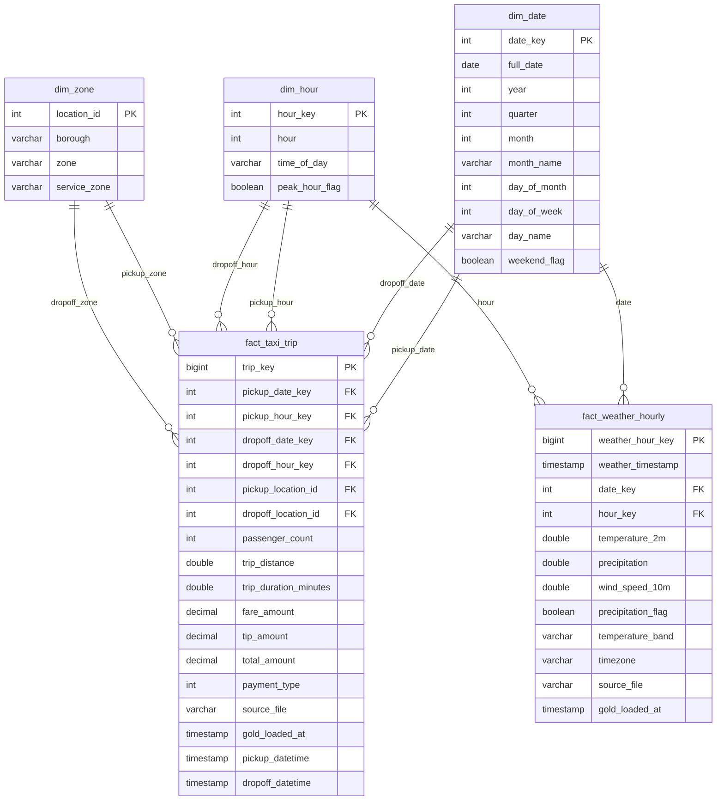

# NYC Mobility Data Model

**Owner:** Tina (`crisstin92-ui`)  
**Status:** Implementation contract under final team review  
**Scope:** NYC Green Taxi, Open-Meteo weather, and NYC Taxi Zones  
**Analysis period:** March 1-May 31, 2026  
**Analytical timezone:** America/New_York  
**Target:** Bronze -> Silver -> Gold galaxy schema

This document defines the agreed table grains, keys, fields, joins, quality rules, and evidence required for implementation. It does not claim that Silver and Gold tables already exist.

## 1. Verified source evidence

| Source | Verified evidence | Required action |
|---|---|---|
| Green Taxi | 133,367 Bronze rows across March-May; 0 exact full-row duplicate groups; 384 candidate duplicate groups; 11 pickups before March 1; 1 negative-duration row; 99 zero-duration rows; 384 negative fare rows; 391 negative total rows | Preserve source rows in Silver, assign a `BIGINT` surrogate `trip_key`, and add quality flags; exclude invalid measures only from affected Gold metrics |
| Weather | 3 monthly JSON responses; 744 March hours, 720 April hours, 744 May hours; 2,208 total hourly positions; no array-length mismatch or null hourly elements observed | Explode arrays by matching position and require one unique weather row per local hour |
| Taxi Zones | 265 rows and 265 distinct LocationID values; no null or duplicate keys; IDs 1-265 are present | Keep LocationID 264 (`Unknown`) and 265 (`Outside of NYC`) as valid dimension members |

Evidence is recorded in:

- [Angela Bronze profile](../profiles/angela.md)
- [Tina Bronze profile](../profiles/tina.md)
- [Virna Bronze profile](../profiles/virna.md)
- [Raw acquisition report](../evidence/raw_acquisition_report.md)
- [Raw acquisition checklist](../evidence/raw_acquisition_checklist.md)

## 2. Catalog and schema contract

The official Databricks namespaces confirmed by the team are:

| Layer | Catalog / schema |
|---|---|
| Bronze | `nyc_bronze` |
| Silver | `nyc_silver` |
| Gold | `nyc_gold` |

These names are the agreed implementation targets for the Bronze, Silver, and Gold layers in this model.

## 3. Layer contracts

### Bronze

| Table | Grain | Required lineage |
|---|---|---|
| `bronze_green_taxi_raw` | One ingested Green Taxi source record | `_source_file`, `_ingested_at` |
| `bronze_weather_raw` | One monthly Open-Meteo response | `_source_file`, `_ingested_at` |
| `bronze_taxi_zones_raw` | One taxi-zone reference record | `_source_file`, `_ingested_at` |

Bronze preserves received values. Cleaning, filtering, and deduplication do not occur in Bronze.

### Silver

| Table | Grain and key | Required content |
|---|---|---|
| `silver_green_taxi_trips` | One retained source trip; unique `BIGINT` surrogate `trip_key` | Local pickup/drop-off timestamps, pickup/drop-off date and hour, pickup/drop-off LocationID, trip measures, payment fields, source lineage, and quality flags |
| `silver_weather_hourly` | One weather observation per `America/New_York` hour; unique `weather_hour_local` | Temperature in °C, precipitation in mm, wind speed in km/h, timezone, source lineage |
| `silver_taxi_zones` | One row per LocationID; unique `location_id` | Borough, zone, service_zone, source lineage |

The tested taxi composite of VendorID, pickup timestamp, drop-off timestamp, pickup LocationID, and drop-off LocationID is not unique. It cannot be used as the trip primary key without a stable source-record discriminator.

## 4. Approved Gold galaxy schema

The approved model is a **galaxy schema** with two fact tables (`fact_taxi_trip` and `fact_weather_hourly`) sharing conformed date, hour, and zone dimensions where applicable. The schema below matches the team's supplied ERD.

### 4.1 Visual schema



> **Weather relationship:** `fact_taxi_trip` does not store a direct weather foreign key in the approved schema. Taxi-weather analysis is performed by matching the trip's `pickup_date_key + pickup_hour_key` to `fact_weather_hourly.date_key + hour_key`. This keeps weather as a separate fact while preserving the galaxy design.

### 4.2 Dimensions

| Table | Grain | Primary key | Main attributes |
|---|---|---|---|
| `dim_date` | One calendar date | `date_key` | `full_date`, `year`, `quarter`, `month`, `month_name`, `day_of_month`, `day_of_week`, `day_name`, `weekend_flag` |
| `dim_hour` | One hour of day | `hour_key` | `hour`, `time_of_day`, `peak_hour_flag` |
| `dim_zone` | One NYC taxi location | `location_id` | `borough`, `zone`, `service_zone` |

### 4.3 Facts

#### `fact_taxi_trip`

**Grain:** one row = one retained Green Taxi trip.

**Primary key:** `trip_key`.

| Field | Type | Nullable | Key / role | Notes |
|---|---|---|---|---|
| `trip_key` | bigint | No | PK | Surrogate warehouse key assigned to the retained taxi fact row; not a source-provided trip ID. |
| `pickup_date_key` | int | No | FK | Joins to `dim_date.date_key`. |
| `pickup_hour_key` | int | No | FK | Joins to `dim_hour.hour_key`. |
| `dropoff_date_key` | int | No | FK | Joins to `dim_date.date_key`. |
| `dropoff_hour_key` | int | No | FK | Joins to `dim_hour.hour_key`. |
| `pickup_location_id` | int | No | FK | Joins to `dim_zone.location_id`. |
| `dropoff_location_id` | int | No | FK | Joins to `dim_zone.location_id`. |
| `passenger_count` | int | Yes | Measure/input | Preserve source nulls; zero is distinct from null. |
| `trip_distance` | double | No | Measure | Preserve source value until final TLC consumer-facing unit is confirmed. |
| `trip_duration_minutes` | double | No | Derived measure | Drop-off timestamp minus pickup timestamp, expressed in minutes. |
| `fare_amount` | decimal(12,2) | No | Measure | Preserve source value; negative values are flagged/excluded from standard positive-revenue metrics. |
| `tip_amount` | decimal(12,2) | No | Measure | Preserve source value. |
| `total_amount` | decimal(12,2) | No | Measure | Preserve source value; negative values are flagged/excluded from standard positive-revenue metrics. |
| `payment_type` | int | Yes | Attribute | Preserve source nulls. |
| `source_file` | varchar | No | Lineage | Source file identifier. |
| `gold_loaded_at` | timestamp | No | Lineage | Gold load timestamp. |
| `pickup_datetime` | timestamp | No | Event timestamp | Canonical analytical timestamp in `America/New_York`. |
| `dropoff_datetime` | timestamp | No | Event timestamp | Canonical analytical timestamp in `America/New_York`. |

#### `fact_weather_hourly`

**Grain:** one row = one weather observation for one local hour.

**Primary key:** `weather_hour_key`.

| Field | Type | Nullable | Key / role | Notes |
|---|---|---|---|---|
| `weather_hour_key` | bigint | No | PK | Deterministic warehouse key for the local weather hour. |
| `weather_timestamp` | timestamp | No | Natural time component | Source hourly timestamp aligned to `America/New_York`. |
| `date_key` | int | No | FK | Joins to `dim_date.date_key`. |
| `hour_key` | int | No | FK | Joins to `dim_hour.hour_key`. |
| `temperature_2m` | double | Yes | Measure | °C. |
| `precipitation` | double | Yes | Measure | mm. |
| `wind_speed_10m` | double | Yes | Measure | km/h. |
| `precipitation_flag` | boolean | No | Derived quality/feature | Indicates precipitation for the hourly observation. |
| `temperature_band` | varchar | Yes | Derived feature | Standardized temperature category. |
| `timezone` | varchar | No | Source metadata | Expected `America/New_York`. |
| `source_file` | varchar | No | Lineage | Source file identifier. |
| `gold_loaded_at` | timestamp | No | Lineage | Gold load timestamp. |

### 4.4 Silver-to-Gold lineage

```text
BRONZE
  ├── bronze_green_taxi_raw
  ├── bronze_weather_raw
  └── bronze_taxi_zones_raw
          │
          ▼
SILVER
  ├── silver_green_taxi_trips
  ├── silver_weather_hourly
  └── silver_taxi_zones
          │
          ▼
GOLD GALAXY
  ├── dim_date
  ├── dim_hour
  ├── dim_zone
  ├── fact_taxi_trip
  └── fact_weather_hourly
```

## 5. Model decisions

| Decision | Agreed rule |
|---|---|
| Schema type | Galaxy schema |
| Taxi fact grain | One retained Green Taxi trip |
| Weather fact grain | One observation per local hour |
| Taxi primary key | `BIGINT` surrogate `trip_key` |
| Weather primary key | Deterministic `weather_hour_key` |
| Zone key | `location_id` |
| Taxi-weather relationship | Match pickup `date_key + hour_key` to weather `date_key + hour_key` |
| Weather storage | Separate fact table |
| Duplicate handling | Preserve and flag in Silver; do not automatically drop candidate duplicates |
| Invalid measures | Preserve in Silver; exclude affected records/measures from applicable Gold metrics |
| Timezone | `America/New_York` |
| Official namespaces | `nyc_bronze`, `nyc_silver`, `nyc_gold` |

### Key schema correction

The initial documentation described `trip_key` as a deterministic string/hash-based identifier. After schema review, the team agreed to use `BIGINT` as a surrogate key for `fact_taxi_trip`. This document has been updated to reflect the approved warehouse key design. Source/business trip attributes remain available for reconciliation, deduplication, and business-level trip identification.

## 6. Required relationships and cardinality

| From | To | Cardinality and rule |
|---|---|---|
| `fact_taxi_trip.pickup_date_key` | `dim_date.date_key` | Many-to-one |
| `fact_taxi_trip.dropoff_date_key` | `dim_date.date_key` | Many-to-one |
| `fact_taxi_trip.pickup_hour_key` | `dim_hour.hour_key` | Many-to-one |
| `fact_taxi_trip.dropoff_hour_key` | `dim_hour.hour_key` | Many-to-one |
| `fact_taxi_trip.pickup_location_id` | `dim_zone.location_id` | Many-to-one |
| `fact_taxi_trip.dropoff_location_id` | `dim_zone.location_id` | Many-to-one |
| `fact_weather_hourly.date_key` | `dim_date.date_key` | Many-to-one |
| `fact_weather_hourly.hour_key` | `dim_hour.hour_key` | Many-to-one |
| `fact_taxi_trip.(pickup_date_key, pickup_hour_key)` | `fact_weather_hourly.(date_key, hour_key)` | Many-to-one logical weather lookup; use a left join so missing weather never removes a taxi trip |

Before integration:

1. `dim_date.date_key` must be unique.
2. `dim_hour.hour_key` must be unique.
3. `dim_zone.location_id` must be unique.
4. `fact_weather_hourly.(date_key, hour_key)` must identify at most one weather observation.
5. Taxi-weather enrichment must never increase the taxi-trip row count.

## 7. Time and units

- Treat Green Taxi timestamps as NYC local timestamps.
- Use `America/New_York` for taxi-weather alignment.
- Use timezone-aware logic for the March daylight-saving transition; do not hard-code one UTC offset.
- Derive `trip_duration_minutes` from drop-off minus pickup timestamps.
- Preserve `trip_distance` as the TLC source value until the exact consumer-facing unit is confirmed from TLC documentation.
- Preserve monetary source values; do not silently replace negatives with zero.
- Weather units are °C, mm, and km/h.

## 8. Quality policy

| Condition | Silver treatment | Gold treatment |
|---|---|---|
| Candidate taxi duplicate | Preserve and flag | Count according to the accepted eligibility rule; do not automatically drop |
| Exact full-row duplicate | Investigate and quarantine or reject according to evidence | Must not create duplicate fact keys |
| Pickup outside March-May | Preserve with `is_in_analysis_window = false` | Exclude from required reporting |
| Negative duration | Preserve and flag invalid | Exclude from duration metrics |
| Zero duration | Preserve and flag for review | Keep distinct from null |
| Negative distance | Preserve and flag invalid | Exclude from distance metrics |
| Negative fare or total | Preserve and flag | Exclude from standard positive-revenue metrics |
| Missing weather hour | Preserve taxi trip | Left join and record missing-weather status in downstream analysis |
| Unknown/outside zone 264 or 265 | Preserve as valid reference member | Keep in `dim_zone` and reporting |

Null is not equivalent to zero or the text `Unknown`.

## 9. Incremental and idempotent processing

- Green Taxi is processed by source file and pickup month.
- Weather is processed by `weather_timestamp` / local weather hour.
- Taxi Zones is refreshed by deterministic overwrite or upsert on `location_id`.
- `trip_key` is a `BIGINT` surrogate key assigned to a retained fact row; reruns must match existing source/business identity before assigning a new surrogate key.
- Reprocessing the same source file or month must not create duplicate taxi fact rows or duplicate surrogate identities.
- A rerun replaces or upserts only affected business records; it must not blindly append.
- Run March, then add April, then add May without rebuilding accepted prior months.
- Run the May load twice. Silver and Gold row counts and measure totals must remain unchanged on the second run.

## 10. Business-question coverage

| Business question | Required tables and grouping |
|---|---|
| When and where is taxi demand highest? | `fact_taxi_trip` grouped through `dim_date`, `dim_hour`, and pickup `dim_zone` |
| How does weather affect demand and trip behavior? | Match `fact_taxi_trip` pickup date/hour to `fact_weather_hourly` date/hour; compare trip count, duration, distance, fare, and total amount |
| Which areas show the strongest mobility patterns or opportunities? | `fact_taxi_trip` grouped by pickup/drop-off `dim_zone` and compared across `dim_date`, `dim_hour`, and weather conditions |

## 11. Acceptance evidence

The pipeline is accepted only when the following checks return evidence, not only documentation:

| Check | Pass condition |
|---|---|
| Bronze counts | Green Taxi = 133,367; Weather raw responses = 3; Taxi Zones = 265 |
| Weather explosion | 2,208 hourly positions before any documented DST-specific adjustment |
| Silver trip key | `trip_key` is non-null, `BIGINT`, unique, and assigned as a surrogate warehouse key |
| Silver weather key | `weather_hour_local` is non-null and unique |
| Zone key | `location_id` is non-null and unique |
| Foreign keys | Pickup and drop-off zone keys resolve, including valid members 264 and 265 |
| Join cardinality | Zone and weather enrichment do not increase taxi-trip row count |
| Gold grains | `fact_taxi_trip.trip_key` and `fact_weather_hourly.weather_hour_key` are unique |
| Reconciliation | Gold trip rows reconcile to eligible Silver trips; excluded records are counted by reason |
| Idempotency | A repeated May load changes neither accepted row counts nor totals |
| Analytics | All three required questions have executable SQL and saved result evidence |

## 12. Execution order

1. Land and verify the three required raw sources.
2. Run the three Bronze tables and record counts.
3. Build and validate `silver_taxi_zones`.
4. Build and validate `silver_weather_hourly`.
5. Build and validate `silver_green_taxi_trips`.
6. Run Silver key, quality, and reconciliation checks.
7. Build `dim_date`, `dim_hour`, `dim_zone`, `fact_weather_hourly`, and `fact_taxi_trip`.
8. Validate join cardinality and Gold grains.
9. Run incremental and repeated-load tests.
10. Run the three analytics queries and save concise evidence.

## 13. Current limitations

- NYC DOT traffic advisories are optional and excluded from the required model.
- Silver and Gold implementations must still provide Databricks run evidence before this contract can be marked complete.
- Exact TLC labels for trip distance and currency must be confirmed from the source documentation before final consumer-facing release.
